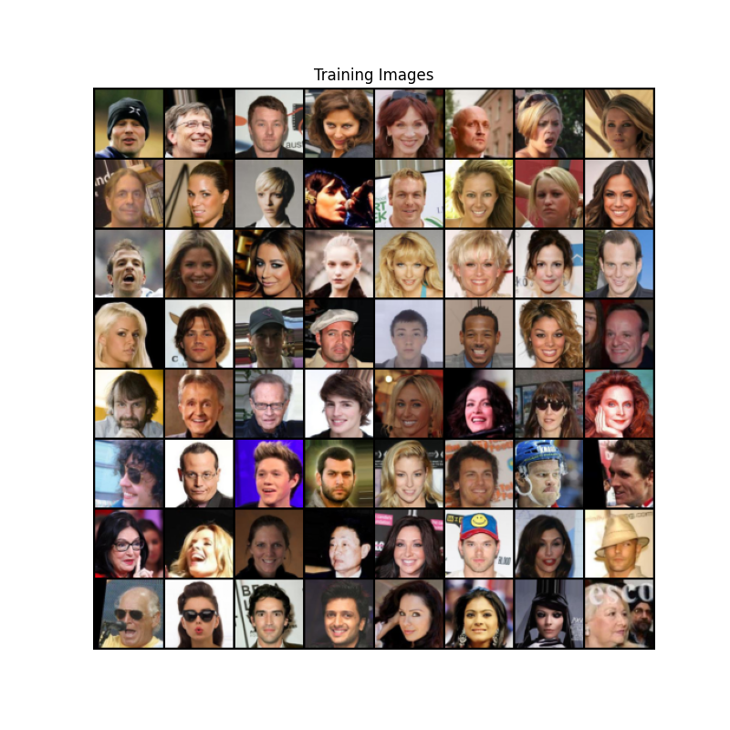
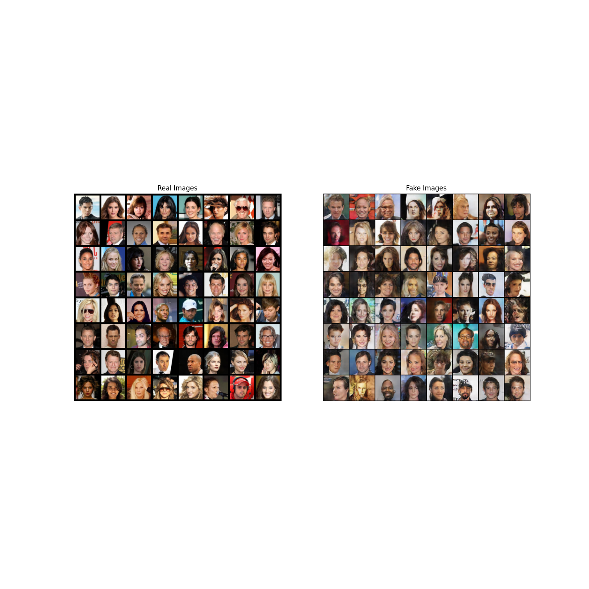

# DCGAN Tutorial

## 1. Introduction

This tutorial will give an introduction to DCGANs through an example. We will train a generative adversarial network (GAN) to generate new celebrities after showing it pictures of many real celebrities. Most of the code here is from the dcgan implementation in [pytorch/examples](https://github.com/pytorch/examples), and this document will give a thorough explanation of the implementation and shed light on how and why this model works. But don’t worry, no prior knowledge of GANs is required, but it may require a first-timer to spend some time reasoning about what is actually happening under the hood. Also, for the sake of time it will help to have a GPU, or two. Lets start from the beginning.

## 2. What is a GAN?

GANs are a framework for teaching a DL model to capture the training data’s distribution so we can generate new data from that same distribution. GANs were invented by Ian Goodfellow in 2014 and first described in the paper [Generative Adversarial Nets](https://papers.nips.cc/paper/2014/file/5ca3e9b122f61f8f06494c97b1afccf3-Paper.pdf). They are made of two distinct models, a generator and a discriminator. The job of the generator is to spawn ‘fake’ images that look like the training images. The job of the discriminator is to look at an image and output whether or not it is a real training image or a fake image from the generator. During training, the generator is constantly trying to outsmart the discriminator by generating better and better fakes, while the discriminator is working to become a better detective and correctly classify the real and fake images. The equilibrium of this game is when the generator is generating perfect fakes that look as if they came directly from the training data, and the discriminator is left to always guess at 50% confidence that the generator output is real or fake.

## 3. What is a DCGAN?

A DCGAN is a direct extension of the GAN described above, except that it explicitly uses convolutional and convolutional-transpose layers in the discriminator and generator, respectively. It was first described by Radford et. al. in the paper [Unsupervised Representation Learning With Deep Convolutional Generative Adversarial Networks](https://arxiv.org/pdf/1511.06434.pdf). The discriminator is made up of strided convolution layers, batch norm layers, and LeakyReLU activations. The input is a 3x64x64 input image and the output is a scalar probability that the input is from the real data distribution. The generator is comprised of convolutional-transpose layers, batch norm layers, and ReLU activations. The input is a latent vector, zzz, that is drawn from a standard normal distribution and the output is a 3x64x64 RGB image. The strided conv-transpose layers allow the latent vector to be transformed into a volume with the same shape as an image. In the paper, the authors also give some tips about how to setup the optimizers, how to calculate the loss functions, and how to initialize the model weights, all of which will be explained in the coming sections.

## 4. Data

In this tutorial we will use the [Celeb-A Faces](http://mmlab.ie.cuhk.edu.hk/projects/CelebA.html) dataset which can be downloaded at the linked site, or in [Google Drive](http://mmlab.ie.cuhk.edu.hk/projects/CelebA.html). The dataset will download as a file named *img_align_celeba.zip*. Once downloaded, create a directory named celeba and extract the zip file into that directory. Then, set the dataroot input for this notebook to the celeba directory you just created. The resulting directory structure should be:

```
/data/celeba
    -> img_align_celeba
        -> 000001.jpg
        -> 000002.jpg
        -> 000003.jpg
        -> 000004.jpg
           ...
```




## 5. Implementation

With our input parameters set and the dataset prepared, we can now get into the implementation. We will start with the weight initialization strategy, then talk about the generator, discriminator, loss functions, and training loop in detail.
### 5.1 Weight Initialization

From the DCGAN paper, the authors specify that all model weights shall be randomly initialized from a Normal distribution with `mean=0`, `stdev=0.02`. The `weights_init` function takes an initialized model as input and reinitializes all convolutional, convolutional-transpose, and batch normalization layers to meet this criteria. This function is applied to the models immediately after initialization.


### 5.2 Generator

The generator, `G`, is designed to map the latent space vector(`z`) to data-space. Since our data are images, converting `z` to data-space means ultimately creating a RGB image with the same size as the training images (i.e. 3x64x64). In practice, this is accomplished through a series of strided two dimensional convolutional transpose layers, each paired with a 2d batch norm layer and a relu activation. The output of the generator is fed through a tanh function to return it to the input data range of `[−1,1]`. It is worth noting the existence of the batch norm functions after the conv-transpose layers, as this is a critical contribution of the DCGAN paper. These layers help with the flow of gradients during training. An image of the generator from the DCGAN paper is shown below.


### 5.3 Discriminator

As mentioned, the discriminator, `D`, is a binary classification network that takes an image as input and outputs a scalar probability that the input image is real (as opposed to fake). Here, `D` takes a `3x64x64` input image, processes it through a series of `Conv2d`, `BatchNorm2d`, and `LeakyReLU` layers, and outputs the final probability through a Sigmoid activation function. This architecture can be extended with more layers if necessary for the problem, but there is significance to the use of the strided convolution, BatchNorm, and LeakyReLUs. The DCGAN paper mentions it is a good practice to use strided convolution rather than pooling to downsample because it lets the network learn its own pooling function. Also batch norm and leaky relu functions promote healthy gradient flow which is critical for the learning process of both `G` and `D`.


## 6. Training
Finally, now that we have all of the parts of the GAN framework defined, we can train it. Be mindful that training GANs is somewhat of an art form, as incorrect hyperparameter settings lead to mode collapse with little explanation of what went wrong. Here, we will closely follow Algorithm 1 from Goodfellow’s paper, while abiding by some of the best practices shown in [ganhacks](https://github.com/soumith/ganhacks). Namely, we will “construct different mini-batches for real and fake” images, and also adjust G’s objective function to maximize `logD(G(z))`. Training is split up into two main parts. Part 1 updates the Discriminator and Part 2 updates the Generator.

### Part 1 - Train the Discriminator

Recall, the goal of training the discriminator is to maximize the probability of correctly classifying a given input as real or fake. In terms of Goodfellow, we wish to “update the discriminator by ascending its stochastic gradient”. Practically, we want to maximize `log(D(x))+log(1−D(G(z)))`. Due to the separate mini-batch suggestion from ganhacks, we will calculate this in two steps. First, we will construct a batch of real samples from the training set, forward pass through `D`, calculate the `loss(log(D(x))`, then calculate the gradients in a backward pass. Secondly, we will construct a batch of fake samples with the current generator, forward pass this batch through `D`, calculate the `loss(log(1−D(G(z)))`, and accumulate the gradients with a backward pass. Now, with the gradients accumulated from both the all-real and all-fake batches, we call a step of the Discriminator’s optimizer.

### Part 2 - Train the Generator

As stated in the original paper, we want to train the Generator by minimizing `log(1−D(G(z)))` in an effort to generate better fakes. As mentioned, this was shown by Goodfellow to not provide sufficient gradients, especially early in the learning process. As a fix, we instead wish to maximize `log(D(G(z)))`. In the code we accomplish this by: classifying the Generator output from Part 1 with the Discriminator, computing G’s loss using real labels as GT, computing G’s gradients in a backward pass, and finally updating G’s parameters with an optimizer step. It may seem counter-intuitive to use the real labels as GT labels for the loss function, but this allows us to use the `log(x)` part of the BCELoss (rather than the `log(1−x)` part) which is exactly what we want.

Finally, we will do some statistic reporting and at the end of each epoch we will push our fixed_noise batch through the generator to visually track the progress of G’s training. The training statistics reported are:

- **Loss_D** - discriminator loss calculated as the sum of losses for the all real and all fake batches `(log(D(x)+log(1−D(G(z)))`.
- **Loss_G** - generator loss calculated as `log(D(G(z)))`
- **D(x)** - the average output (across the batch) of the discriminator for the all real batch. This should start close to 1 then theoretically converge to 0.5 when G gets better. Think about why this is.
- **D(G(z))** - average discriminator outputs for the all fake batch. The first number is before D is updated and the second number is after D is updated. These numbers should start near 0 and converge to 0.5 as G gets better. Think about why this is.

## 7. Results

Finally, lets check out how we did. Here, we will look at three different results. First, we will see how D and G’s losses changed during training. Second, we will visualize G’s output on the fixed_noise batch for every epoch. And third, we will look at a batch of real data next to a batch of fake data from G.



## 8. Source
1. [Pytorch - DCGAN Tutorial](https://pytorch.org/tutorials/beginner/dcgan_faces_tutorial.html)